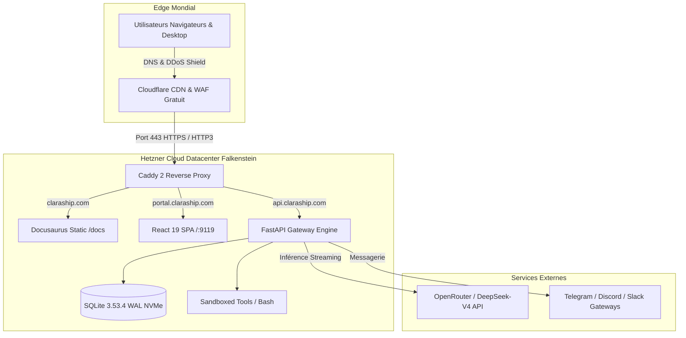

# 📊 ÉTUDE COMPARATIVE & STRATÉGIE D'HÉBERGEMENT EN PRODUCTION POUR CLARASHIP

**Auteur** : Équipe Architecture Claraship  
**Date** : Septembre 2026  
**Cible** : Déploiement public mondial de la plateforme Claraship (`claraship.com`, `portal.claraship.com`, `api.claraship.com`)  
**Statut** : Document de référence décisionnel  

---

## 1. Analyse des Exigences Techniques & Profil de Charge

Pour choisir la meilleure infrastructure, il est indispensable de disséquer le profil d'exécution exact de Claraship :

| Composant | Nature du Workload | Exigence Critique | Impact sur le Choix d'Hébergement |
| :--- | :--- | :--- | :--- |
| **Agent Core & Backend** | Python 3.12 / FastAPI / Uvicorn | Faible CPU en idle, pics modérés lors de l'exécution d'outils | Pas besoin de GPU sur l'hôte. Inférence 100% déportée vers OpenRouter / DeepSeek. |
| **Base de Données (`state.db`)** | SQLite avec WAL (Write-Ahead Logging) & FTS5 | IOPS élevés en écriture concurrente (latence disque critique) | **Élimine le Serverless pur**. Requiert un stockage disque local monté en direct sur SSD NVMe. |
| **Chat Interactif & Terminal Web** | Streaming SSE & WebSockets bidirectionnels (`/api/pty`) | Connexions TCP persistantes longue durée sans coupure | **Élimine Vercel/Netlify/Lambda** qui coupent les requêtes après 15 à 60 secondes. |
| **Site & Documentation** | Site Docusaurus statique multi-langues (EN, FR, ZH) | Débit de délivrance élevé, mise en cache edge | Servi directement par Caddy ou CDN Cloudflare (charge CPU quasi nulle). |
| **Téléchargement d'Applications** | Fichiers d'installation Desktop macOS (`.dmg` 148 Mo, `.zip` 132 Mo) | Bande passante réseau sortante (egress data) | **Risque financier majeur sur AWS/GCP** où la bande passante sortante est facturée à l'octet. |

---

## 2. Benchmark Comparatif des 5 Familles d'Hébergement

### Famille 1 : Cloud VPS Européen (Hetzner, OVHcloud, Scaleway)
* **Architecture** : Machine virtuelle Linux avec vCPU dédiés/partagés, stockage local NVMe et IP publique dédiée.
* **Avantages** :
  - Rapport performance / prix imbattable (4 à 15 € / mois).
  - 20 To de bande passante gratuite par mois (Hetzner) ou trafic illimité (OVH).
  - Contrôle total du système d'exploitation (Docker, Caddy, kernel tuning).
  - Datacenters en Europe (Allemagne, France, Finlande) conformes RGPD.
* **Inconvénients** : Responsabilité de la maintenance de l'OS (automatisée par nos scripts `deploy/setup-host.sh`).

### Famille 2 : PaaS & CaaS Managés (Railway, Render, Fly.io)
* **Architecture** : Conteneurs exécutés sur infrastructure gérée avec déploiement Git direct.
* **Avantages** : Déploiement simplifié, zéro gestion de Linux.
* **Inconvénients** :
  - Coût 3 à 5 fois plus élevé pour les mêmes ressources (20 à 45 € / mois).
  - Gestion fragile des volumes persistants pour SQLite WAL (risques de verrous ou latence I/O).
  - Coûts de bande passante imprévisibles sur les téléchargements lourds.

### Famille 3 : Serverless / Edge (Vercel, AWS Lambda, Cloudflare Pages)
* **Architecture** : Fonctions éphémères déclenchées à la requête.
* **Verdict pour Claraship** : ❌ **Incompatible**. Claraship nécessite un process continu avec mémoire d'état, sessions PTY actives et base SQLite sur disque persistant.

### Famille 4 : Hyperscalers Public Cloud (AWS EC2, Google Cloud, Azure)
* **Architecture** : Instances virtuelles d'entreprise avec écosystème complexe.
* **Avantages** : Haute réputation, SLA élevé, catalogue infini de services.
* **Inconvénients** :
  - **Coût prohibitif** : Une instance 4 vCPU / 8 Go coûte ~60 à 85 €/mois, plus le disque EBS (~8 €/mois).
  - **Frais de bande passante cachés** : 0,09 $ par Go sortant. Si 1 000 utilisateurs téléchargent le `.dmg` (150 Go), AWS vous facture 13,50 $ rien que pour le transfert réseau.
  - Complexité de configuration inutile pour une architecture monolithique légère.

### Famille 5 : Hébergement On-Premise / Mac Local
* **Architecture** : Mac personnel connecté à une box Internet.
* **Verdict pour Claraship** : ❌ **Inadapté pour la production publique**. Pas d'IP fixe garantie, interruptions dues aux veilles/redémarrages, exposition dangereuse du réseau privé familial.

---

## 3. Matrice de Décision Multi-Critères (Note sur 10)

| Critère | Hetzner Cloud | OVHcloud VPS | Railway / Render | AWS EC2 | Mac Local |
| :--- | :---: | :---: | :---: | :---: | :---: |
| **Performance CPU / NVMe** | **9.5/10** | 7.5/10 | 7.0/10 | 8.5/10 | 9.0/10 |
| **Latence I/O SQLite WAL** | **9.5/10** | 8.0/10 | 6.0/10 | 8.0/10 | 9.5/10 |
| **Bande Passante & Egress** | **10/10** (20 To inclus) | 9/10 (Illimité) | 6.0/10 | 3.0/10 (Payant) | 4.0/10 (Upload Box) |
| **Stabilité WebSockets / PTY** | **10/10** | 10/10 | 8.0/10 | 9.5/10 | 5.0/10 |
| **Coût Mensuel Global (TCO)** | **10/10** (~13 €) | 9.5/10 (~11 €) | 5.0/10 (~35 €) | 3.0/10 (~85 €) | 8.0/10 (Élec) |
| **Sécurité & Isolation** | **9.5/10** | 9.5/10 | 8.5/10 | 10/10 | 2.0/10 |
| **Simplicité d'Exploitation** | **9.0/10** | 8.0/10 | 9.5/10 | 5.0/10 | 6.0/10 |
| **NOTE GLOBALE** | **9.6 / 10** | **8.5 / 10** | **7.1 / 10** | **6.7 / 10** | **4.8 / 10** |

---

## 4. Simulation Financière sur 12 Mois (3 Scénarios)

### Scénario 1 : Lancement (0 à 100 utilisateurs actifs/jour)
* Inférence LLM : ~10-20 €/mois (facturée à l'usage par OpenRouter).
* Hébergement Hetzner (CPX31) : **13,50 € / mois** (ou CX22 à 4,50 €/mois).
* Cloudflare CDN & DNS : **0 € / mois** (Plan gratuit).
* **Total infrastructure fixe : ~162 € / an**.
* *(Comparatif AWS sur le même scénario : ~1 140 € / an)*.

### Scénario 2 : Croissance (500 à 2 000 utilisateurs actifs/jour)
* Inférence LLM : Mutualisée ou clés API utilisateurs / abonnements.
* Hébergement Hetzner (CPX41 - 8 vCPU, 16 Go RAM) : **27 € / mois**.
* Stockage Cloudflare R2 pour les DMGs : **~1 à 2 € / mois** (zéro frais d'egress).
* **Total infrastructure fixe : ~340 € / an**.

### Scénario 3 : Grande Échelle (10 000+ utilisateurs actifs/jour)
* Cluster 2 VM Hetzner (1 Web/Caddy + 1 Backend) avec base PostgreSQL managée.
* **Total infrastructure fixe : ~80 à 120 € / mois**.

---

## 5. Architecture Recommandée & Plan d'Implémentation

### Plan d'Action Recommandé :
1. **Création de l'instance Hetzner CPX31 (Ubuntu 24.04 LTS)** en datacenter européen (Falkenstein ou Helsinki).
2. **Pointage DNS sur Cloudflare** : 4 enregistrements de type A (`@`, `www`, `portal`, `api`).
3. **Exécution du script de provisionnement** : `curl -fsSL .../deploy/setup-host.sh | bash`.
4. **Lancement de la stack de production** : `bash deploy/deploy.sh`.
